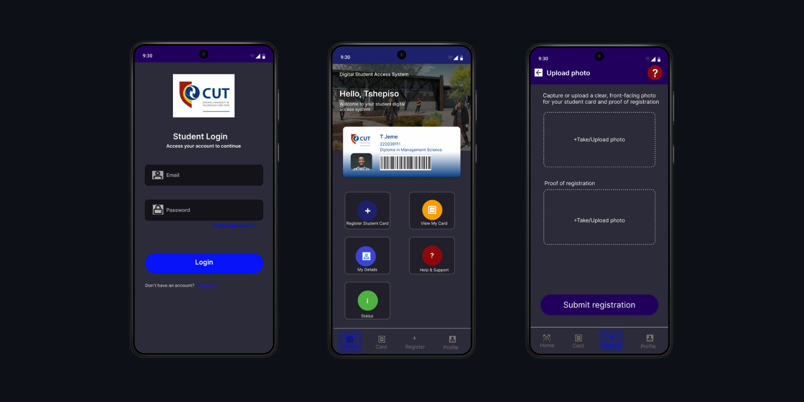

# Digital Student Access System

A modern virtual student-card mobile application, built with Flutter.

## Tech Stack

- Flutter and Dartlang
- Supabase

## Screens



## Getting Started

```bash
git clone https://github.com/githappens/DSAS_Mobile.git
cd DSAS_Mobile
flutter pub get
flutter run
```

## License

MIT License - open [License](https://github.com/githappens)

---
